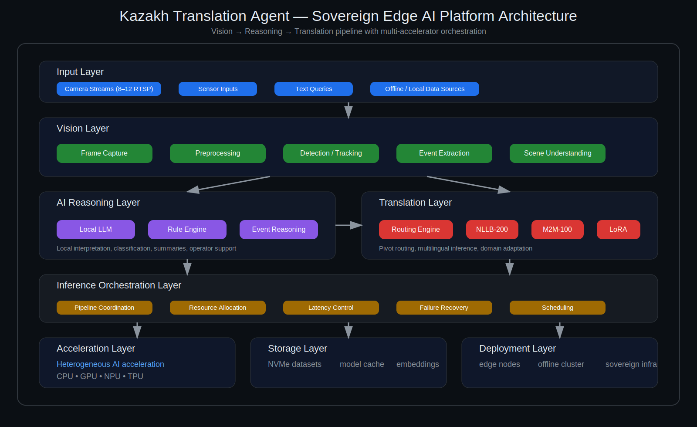

# Kazakh Translation Agent

Adaptive multilingual translation system for the Kazakh language with pivot routing, LoRA specialization, and sovereign edge-AI deployment.

---

## Overview

Kazakh Translation Agent is a research and infrastructure project focused on building a high-quality neural translation system for the Kazakh language.

The architecture combines multilingual transformer models with adaptive routing and parameter-efficient domain specialization.

The system is designed to operate across distributed environments including edge AI nodes, sovereign GPU clusters, and offline infrastructure.

---

## Key Features

• Multilingual neural translation  
• Adaptive pivot-language routing  
• Domain specialization with LoRA adapters  
• Edge-AI deployment capability  
• Sovereign infrastructure compatibility  

---

## Architecture

Edge AI architecture combining vision pipelines, reasoning, and multilingual translation running on a sovereign edge AI node (Jetson + Hailo + Coral).

The translation system consists of four core modules.

Input Processing  
Translation Routing Engine  
Neural Translation Backbone  
Evaluation Framework

See detailed architecture documentation:

docs/architecture/system_architecture.md

---

## Routing Algorithm

The routing engine dynamically determines whether translation should be executed directly or through a pivot language cascade.

Supported pivot languages:

Russian  
English  
Chinese  

Detailed algorithm specification:

docs/architecture/translation_routing_algorithm.md

---

## Deployment

The system is designed for deployment across multiple environments.

• Edge AI nodes  
• Offline translation devices  
• Sovereign GPU clusters  

Deployment documentation:

docs/deployment/edge_node_deployment.md

---

## Evaluation

Translation quality is evaluated using standard machine translation benchmarks.

Supported metrics include:

BLEU  
chrF  
COMET  

Evaluation framework:

evaluation/benchmark_framework.md

---

## Research Paper

The scientific description of the architecture is available in:

docs/paper/kazakh_translation_agent_paper.md

---

## Citation

If you use this repository in research please cite:

Pavlenko, A.  
Kazakh Translation Agent  
AISC Technologies Ltd

---

## License

Apache License 2.0
